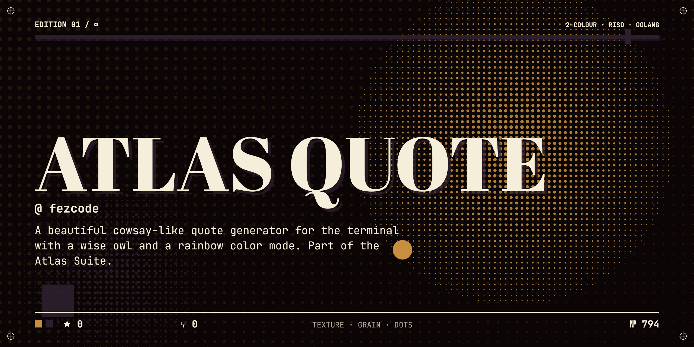

# atlas.quote



A cowsay-like quote generator for the terminal with a rainbow color mode.

## Description
`atlas.quote` is a command-line utility part of the Atlas Suite. It provides inspiring quotes straight to stdout inside a neat ASCII text bubble, with an optional rainbow coloring mode.

## Installation
Requires [gobake](https://github.com/fezcode/gobake).

```sh
gobake build
```

## Usage
Run directly:
```sh
./atlas.quote
```

Rainbow mode:
```sh
./atlas.quote -c
```
